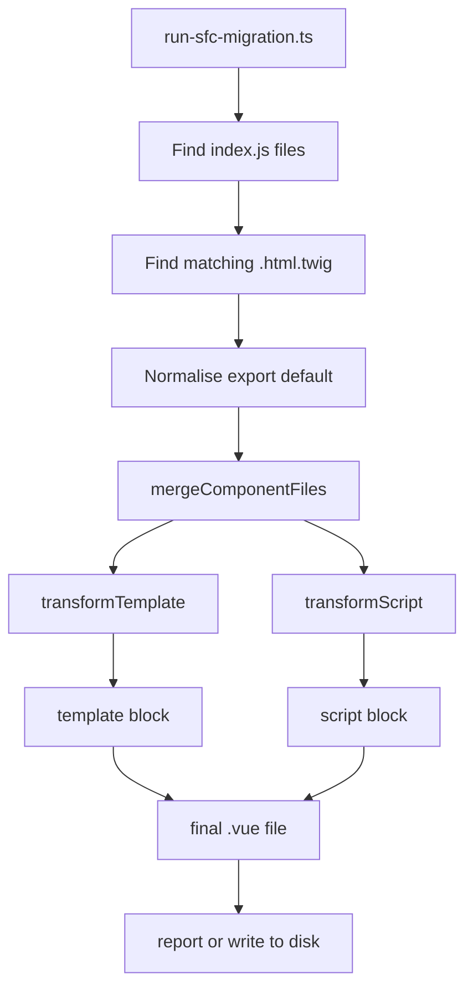
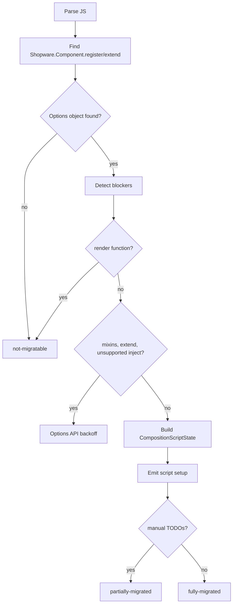

# SFC Migration Codemod: Technical README

This codemod migrates old Shopware Administration components from separate
`index.js` and `.html.twig` files to Vue Single File Components.

Input:

```text
my-component/
|-- index.js
`-- my-component.html.twig
```

Output:

```text
my-component/
|-- index.js
|-- my-component.html.twig
`-- my-component.vue
```

With `--delete-originals`, the codemod also replaces `index.js` with a small
entry point and removes the Twig file.

The important technical part is that the codemod does more than copy files into
an SFC. When possible, it converts Options API component code to Vue 3
`<script setup>` and wraps the generated state in `createExtendableSetup()` so
Shopware component overrides still work.

## High-Level Flow



The code is split into three layers:

| Layer | Main files | Responsibility |
| --- | --- | --- |
| Runner | `run-sfc-migration.ts` | CLI parsing, scanning, file selection, writing, reporting. |
| Merger | `generate-sfc.ts` | Combines one Twig file and one JS file into one SFC string. |
| Transformers | `transform-template.ts`, `script-transformer/*` | Convert template syntax and Options API code. |

## Migration Outcomes

| Status | Meaning | Output |
| --- | --- | --- |
| `fully-migrated` | Template and script were converted automatically. | Writes a `.vue` file. |
| `partially-migrated` | A `.vue` file was generated, but manual follow-up is required. | Writes a `.vue` file. |
| `not-migratable` | A hard blocker was found. | Writes nothing. |

Examples:

| Case | Status |
| --- | --- |
| Normal Options API component | `fully-migrated` |
| Component with `mixins` | `partially-migrated`, script stays Options API |
| Component using `Shopware.Component.extend()` | `partially-migrated`, script stays Options API |
| Component with `render()` | `not-migratable` |
| Template with `` | `not-migratable` |

## Runner Layer

Main file: `run-sfc-migration.ts`

This file handles everything around the transformation:

1. Parses CLI flags.
2. Validates that the target path exists and is a directory.
3. Finds `**/index.js` files with `globSync`.
4. Finds the matching `.html.twig` file for each component.
5. Converts `export default { ... }` files into a temporary `Shopware.Component.register(...)` shape.
6. Calls `mergeComponentFiles(...)`.
7. Writes the `.vue` file or prints a dry-run report.
8. Optionally deletes/replaces original files.

### Twig File Selection

For every `index.js`, the runner looks in the same directory:

1. Prefer `<component-directory-name>.html.twig`.
2. If there is exactly one `.html.twig`, use that.
3. If there are multiple non-matching Twig files, skip the component as ambiguous.
4. If there is no Twig file, skip the component.

### `export default` Normalisation

Some Administration components look like this:

```js
export default {
    data() {
        return { count: 0 };
    },
};
```

`normaliseJsContent()` rewrites that in memory to:

```js
Shopware.Component.register('component-name', {
    data() {
        return { count: 0 };
    },
});
```

This uses `ts-morph`, not plain string replacement, so nested objects and
additional module-level code stay intact.

### Writing And Deleting

| Option | Behavior |
| --- | --- |
| default / `--dry-run` | Does not write files. Reports what would happen. |
| `--write` | Writes `<component-name>.vue`. |
| `--force` | Overwrites existing `.vue` files. |
| `--delete-originals` | After writing, replaces `index.js` and deletes `.html.twig`. |

`not-migratable` components are never written and never have originals deleted.

When originals are deleted, the replacement `index.js` either registers the new
SFC:

```js
import component from './sw-example.vue';

Shopware.Component.register('sw-example', component);
```

or imports the SFC for side effects when the SFC still contains an Options API
`Shopware.Component.register()` or `.extend()` call:

```js
import './sw-example.vue';
```

## SFC Merge Layer

Main file: `generate-sfc.ts`

`mergeComponentFiles(twigContent, jsContent)` is the central function for one
component.

It does this:

1. Runs `transformTemplate(twigContent)`.
2. If template transformation fails with `TemplateTransformError`, returns
   `not-migratable`.
3. Runs `transformScript(...)`.
4. If script transformation is `not-migratable`, returns an empty SFC.
5. Wraps the generated script in `<script setup>` or plain `<script>`.
6. Returns the final SFC with `<template>` first and script second.

The template is transformed first because Twig blocks need a data scope. The
Administration app already provides a global `$dataScope` getter in
`vue.adapter.ts`, which returns the current component proxy. Generated
`<sw-block>` elements therefore keep `:data="$dataScope"` and do not need a
local `$dataScope` variable in the generated script.

## Template Transformer

Main file: `transform-template.ts`

The template transformer is intentionally small. It supports only the Twig
syntax used for Shopware block inheritance and comments.

| Input | Output |
| --- | --- |
| `` | `<sw-block name="sw_foo" :data="$dataScope">` |
| `` | `</sw-block>` |
| `{{ parent() }}` / `` | `<sw-block-parent/>` |
| `{# comment #}` | `<!-- comment -->` |

Plain HTML and Vue template expressions stay unchanged.

Unsupported:

| Input | Result |
| --- | --- |
| `` | `not-migratable`, blocker `twig extends` |
| Twig block syntax inside a Twig comment | `not-migratable`, blocker `twig syntax inside comment` |

The transformer also removes old Twig-block eslint comments when they are next
to a line that was migrated.

## Script Transformer

Entry file: `transform-script.ts`

Implementation file: `script-transformer/transform-script-implementation.ts`

The script transformer uses `ts-morph` to parse the component JavaScript as an
AST. The main decision tree is:



### Registration Detection

`script-transformer/ast.ts` finds the first component registration:

```js
Shopware.Component.register(...)
Shopware.Component.extend(...)
```

It extracts:

| Extracted value | Used for |
| --- | --- |
| `componentName` | `createExtendableSetup({ name })`, reports, generated entry points. |
| `isExtend` | Detecting `.extend()` as a soft blocker. |
| `parentComponentName` | Reporting which parent component must be inlined manually. |
| `optionsObject` | The Options API object that gets converted. |

The same file also preserves module-level code before the registration call,
except `import template from ...`, which is removed because the template is now
inside the SFC.

### Blockers

| Feature | Handling |
| --- | --- |
| `render()` | Hard blocker. No SFC is generated. |
| `mixins` | Soft blocker. Generates a plain Options API `<script>`. |
| `Shopware.Component.extend()` | Soft blocker. Generates a plain Options API `<script>`. |
| Unsupported `inject` shape | Soft blocker. Generates a plain Options API `<script>`. |

Options API backoff is built in `build-options-api-backoff.ts`. It clones the
source AST, removes the template import and template option, and emits the rest
inside a plain `<script>` block.

## Composition API Conversion

The full script conversion has two phases:

1. `composition-script-state.ts` extracts and classifies all Options API parts.
2. `emit-composition-api-script.ts` prints the new `<script setup>` code.

This keeps "understand the old component" separate from "print the new code".

### Extractor Files

| File | Converts or detects |
| --- | --- |
| `extract-component-options.ts` | `props`, `emits`, `inheritAttrs`, `name`, blockers, prop names. |
| `extract-inject.ts` | `inject` array/object syntax, aliases, defaults, factory defaults. |
| `extract-data.ts` | `data()` return values into future `ref(...)` declarations. |
| `extract-computed.ts` | Computed getters and getter/setter objects. |
| `extract-methods.ts` | Methods and property-assignment methods like debounce wrappers. |
| `extract-watch.ts` | Watchers, string handlers, object handlers, `deep`, `immediate`. |
| `extract-lifecycle.ts` | Lifecycle hooks and their Composition API equivalents. |
| `rewrite-this.ts` | Rewrites known `this.*` accesses. |

### Generated Script Shape

`emit-composition-api-script.ts` writes code in this order:

1. TODO comments for manual follow-up.
2. Preserved module-level imports/constants.
3. Vue compiler macros: `defineOptions`, `defineProps`, `defineEmits`.
4. Imports required by the converted code.
5. Composable declarations such as `const router = useRouter()`.
6. Template refs generated from `this.$refs`.
7. `createExtendableSetup(...)`.

The generated setup state looks like this:

```js
const {
    title,
    onSave,
} = createExtendableSetup(
    {
        name: 'sw-example',
        props,
    },
    () => {
        const title = ref('Example');

        const onSave = () => {
            emit('save', title.value);
        };

        return {
            public: {
                title,
                onSave,
            },
        };
    },
);
```

Returning values under `public` is important. It exposes them to the template
and to Shopware's Composition API extension system.

## Why `createExtendableSetup()` Is Used

Shopware plugins can override Administration components. After moving a
component to Composition API, those overrides still need a stable public state
to hook into.

The codemod therefore places converted `inject`, `data`, `computed`, and
`methods` inside `createExtendableSetup()` and returns them as `public`.

For templates with migrated Twig blocks, `<sw-block :data="$dataScope">` uses
the global `$dataScope` getter from `vue.adapter.ts` so block overrides can
access the host component proxy.

## `this.` Rewriting

Main file: `script-transformer/rewrite-this.ts`

The old Options API code uses `this`. The generated Composition API code uses
plain variables, refs, props, and composables.

Common rewrites:

| Old code | New code |
| --- | --- |
| `this.myProp` | `props.myProp` |
| `this.myData` | `myData.value` |
| `this.myComputed` | `myComputed.value` |
| `this.myMethod()` | `myMethod()` |
| `this.myInjection` | `myInjection` |
| `this.$emit(...)` | `emit(...)` |
| `this.$router` | `router` from `useRouter()` |
| `this.$route` | `route` from `useRoute()` |
| `this.$nextTick` | `nextTick` |
| `this.$slots` | `slots` from `useSlots()` |
| `this.$attrs` | `attrs` from `useAttrs()` |
| `this.$t(...)` / `this.$tc(...)` | `t(...)` from `useI18n()` |
| `this.$refs.name` | `name.value` and `const name = ref(null)` |

Risky cases get TODO output instead of pretending the migration is complete:

| Old code | Generated handling |
| --- | --- |
| `this.$el` | `/* TODO: $el */ getCurrentInstance()?.proxy?.$el` |
| `this.$store` | Throwing TODO expression, so it cannot ship unnoticed. |
| `this.$parent`, `this.$root`, `$options`, `$forceUpdate` | TODO placeholders. |

The rewrite only changes AST property-access nodes. It does not rewrite text in
strings or comments.

## Watch And Lifecycle Conversion

Watchers are generated only when the source is clear:

| Watch target | Generated source |
| --- | --- |
| Prop | `() => props.name` |
| Data/computed | `() => name.value` |
| Inject | `() => unref(name)` |
| `$route` | A route snapshot getter based on `route`, `params`, and `query`. |

Unsupported watcher shapes become TODO comments and make the result
`partially-migrated`. Examples are nested paths like `'settings.count'`,
undeclared targets, missing string-handler methods, and non-literal `deep` or
`immediate` options.

Lifecycle hooks are mapped like this:

| Options API | Composition API |
| --- | --- |
| `created()` | Runs directly inside `createExtendableSetup()`. |
| `mounted()` | `onMounted(...)` |
| `beforeMount()` | `onBeforeMount(...)` |
| `beforeUnmount()` / `beforeDestroy()` | `onBeforeUnmount(...)` |
| `unmounted()` / `destroyed()` | `onUnmounted(...)` |
| `updated()` | `onUpdated(...)` |
| `beforeUpdate()` | `onBeforeUpdate(...)` |
| `activated()` | `onActivated(...)` |
| `deactivated()` | `onDeactivated(...)` |

`beforeCreate()` is not converted automatically. It gets a TODO because its
timing does not map cleanly to generated setup code.

## File Map

| File | Purpose |
| --- | --- |
| `README.md` | User-facing usage guide. |
| `TECHNICAL_README.md` | Technical explanation of the implementation. |
| `run-sfc-migration.ts` | CLI, scanning, writing, reporting. |
| `generate-sfc.ts` | Merges template and script transformation results. |
| `transform-template.ts` | Converts supported Twig syntax. |
| `transform-script.ts` | Public export for the script transformer. |
| `types.ts` | Shared status types. |
| `string-literals.ts` | Safe JS string quoting helper. |
| `script-transformer/ast.ts` | AST helpers and component registration detection. |
| `script-transformer/transform-script-implementation.ts` | Script transformation decision tree. |
| `script-transformer/composition-script-state.ts` | Collects all data needed to print setup code. |
| `script-transformer/emit-composition-api-script.ts` | Emits the generated `<script setup>`. |
| `script-transformer/build-options-api-backoff.ts` | Emits plain Options API script for soft blockers. |
| `script-transformer/rewrite-this.ts` | Rewrites known `this.*` references. |
| `script-transformer/extract-*.ts` | Focused extractors for Options API sections. |
| `__fixtures__/` | Input examples used by tests. |
| `__snapshots__/` | Expected generated output snapshots. |
| `*.spec.ts` | Tests for runner behavior, template conversion, script conversion, and final SFC output. |

## How To Extend The Codemod

Use this rule of thumb:

1. Parse or classify new Options API shapes in an `extract-*.ts` file.
2. Add the extracted data to `CompositionScriptState`.
3. Emit the new Composition API code in `emit-composition-api-script.ts`.
4. Add fixtures and tests for the new shape.

Keep the responsibilities separate: the runner handles files, the merger handles
one component pair, extractors understand old code, and the emitter prints new
code.
