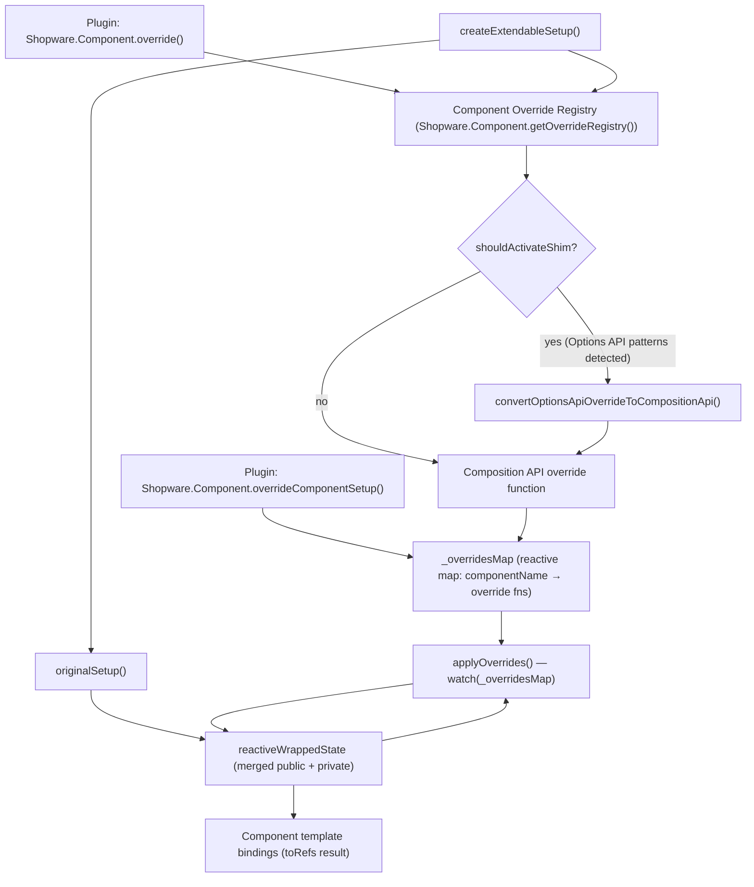

# Composition API Extension System

> **Status:** Experimental — `@experimental stableVersion:v6.8.0 feature:ADMIN_COMPOSITION_API_EXTENSION_SYSTEM`
> **Package:** `@sw-package framework`

The Composition API Extension System is the next-generation mechanism for extending Vue components in the Shopware 6 Administration. It replaces the legacy Component Factory override system with a type-safe, reactive, non-invasive approach based on Vue 3 Composition API.

**Source files:**
- `src/app/adapter/composition-extension-system.ts` — `createExtendableSetup`, `overrideComponentSetup`, `_overridesMap`
- `src/app/adapter/options-composition-shim.ts` — backward-compatibility layer for Options API overrides

---

## Architecture Overview



### Key data structures

| Symbol | Type | Description |
|---|---|---|
| `_overridesMap` | `reactive({ [name]: Array<OverrideFn> })` | Central reactive registry mapping each component name to its ordered list of override functions |
| `ComponentPublicApiMapping` | Global TypeScript interface | Maps component names to their typed public API shapes; extended by component authors |

---

## `createExtendableSetup`

**Location:** `composition-extension-system.ts`

Wraps a component's setup function to make it extendable at runtime. Components must call this instead of returning their setup result directly.

### Signature

```typescript
function createExtendableSetup<
    PROPS,
    CONTEXT,
    COMPONENT_NAME extends keyof ComponentPublicApiMapping,
    SETUP_RESULT extends ComponentPublicApiMapping[COMPONENT_NAME],
    PRIVATE_SETUP_RESULT extends object,
>(
    options: {
        name: COMPONENT_NAME;
        props: PROPS;
        context?: CONTEXT;
    },
    originalSetup: (props: PROPS, context: CONTEXT) => {
        public?: SETUP_RESULT;
        private?: PRIVATE_SETUP_RESULT;
    },
): ToRefs<Reactive<SETUP_RESULT & PRIVATE_SETUP_RESULT>>
```

### Parameters

| Parameter | Description |
|---|---|
| `options.name` | Component name key — must match a key in `ComponentPublicApiMapping` |
| `options.props` | The props object passed into the Vue `setup()` function |
| `options.context` | Optional; automatically resolved from `getCurrentInstance()` if omitted |
| `originalSetup` | The component's own setup logic; must return `{ public?, private? }` |

### Return value

`ToRefs` of the merged public + private state. This is returned directly from the Vue `setup()` function, exposing all keys as refs for use in the template.

### `public` / `private` API split

The `originalSetup` callback splits its return value into two buckets:

- **`public`** — keys in this object form the component's extension API. Override functions receive them via `previousState`. The shape must match `ComponentPublicApiMapping[name]` exactly.
- **`private`** — internal state that is not part of the public extension API. Accessible in overrides under `previousState._private`.

```typescript
return createExtendableSetup(
    { name: 'sw-my-component', props },
    (props) => {
        const title = ref('Hello');
        const internalId = ref<string | null>(null);

        return {
            public: { title },      // accessible as previousState.title
            private: { internalId }, // accessible as previousState._private.internalId
        };
    },
);
```

### Error conditions

| Condition | Logged as |
|---|---|
| `originalSetup` returns neither `public` nor `private` | `console.error` — returns `{}` |
| `originalSetup` returns a key other than `public` or `private` | `console.error` |
| `originalSetup` includes a prop key in its return value | `console.error` — that key is deleted from the result |

### Registering the TypeScript type

Every component that uses `createExtendableSetup` should extend `ComponentPublicApiMapping` globally so overrides are fully typed:

```typescript
declare global {
    interface ComponentPublicApiMapping {
        'sw-my-component': {
            title: Ref<string>;
            save: () => Promise<void>;
        };
    }
}
```

Components not registered in this interface fall back to `{ [key: string]: any }`.

### Override application lifecycle

1. `originalSetup` runs and produces the initial state.
2. An async IIFE reads all pending overrides from `Shopware.Component.getOverrideRegistry()` for this component name. Each pending override that contains Options API patterns is converted via the shim (see below); the resulting Composition API function is pushed into `_overridesMap[name]`.
3. A `watch` on `_overridesMap[name]` (with `{ deep: true, immediate: true }`) calls `applyOverrides` whenever the array changes.
4. `applyOverrides` iterates overrides in registration order. Already-applied overrides are skipped (tracked in `appliedOverrides`).
5. Each override result is merged into `reactiveWrappedState` according to the return-type rules.
6. `toRefs(reactiveWrappedState)` is returned to Vue so all state is reactive in the template.

---

## `overrideComponentSetup`

**Location:** `composition-extension-system.ts`

Plugin authors use this function to register a Composition API override for a specific component. It is exposed on `Shopware.Component`.

### Signature

```typescript
function overrideComponentSetup(): (
    componentName: keyof ComponentPublicApiMapping,
    override: OverrideFn,
) => void
```

### Usage

```javascript
Shopware.Component.overrideComponentSetup()('sw-my-component', (previousState, props, context) => {
    // ... return overrides
});
```

### Override function arguments

| Argument | Type | Description |
|---|---|---|
| `previousState` | `ComponentPublicApiMapping[name] & { _private }` | Shallow copy of the component's current state after all previous overrides have been applied. Public keys are at the top level; private keys are under `_private`. Refs are **not** unwrapped — access `.value` directly. |
| `props` | Component props (readonly) | The current prop values. Cannot be returned in the override result. |
| `context` | `SetupContext` | Vue setup context: `attrs`, `slots`, `emit`, `expose`. |

### Override return types

The override function returns a plain object. Each key in the result is merged back into the component state according to the following rules:

| Return value type | Merge behavior |
|---|---|
| Plain `ref` (non-computed, non-readonly) | 2-way sync (`syncRef`) with the existing state ref. Both the override ref and the original ref stay in sync. |
| Readonly `computed` ref | Replaces the existing property in `reactiveWrappedState` directly. |
| Writable `computed` ref (has `.effect`) | Wrapped in a new `computed({ get, set })` and assigned to `reactiveWrappedState`. |
| `reactive` object | Merged via `Object.assign` into the existing reactive value. The new object must contain **all keys** of the original (recursive check). |
| `function` | Replaces the existing function directly. |

Returning a key that matches a component **prop** name logs `console.error` and is ignored.

### Multiple overrides

Multiple overrides are applied in registration order. Each receives a shallow copy of the state as modified by all previous overrides, so later overrides always see the latest state.

---

## Options API Shim

**Location:** `options-composition-shim.ts`

The shim is a backward-compatibility layer that allows existing plugins using the Options API `Shopware.Component.override()` pattern to continue working when the target component has been migrated to Composition API with `createExtendableSetup`.

### Activation

The shim is **automatically activated** by `createExtendableSetup` when it processes a pending override from the component factory registry. It is never called directly by plugin authors.

`shouldActivateShim(overrideConfig)` returns `true` when the override config contains any of:

- `data`
- `methods`
- `computed`
- `watch`
- `mixins` (non-empty array)
- `inject`
- `extends`
- Any lifecycle hook key (`beforeCreate`, `created`, `beforeMount`, `mounted`, `beforeUpdate`, `updated`, `beforeUnmount`, `unmounted`, `activated`, `deactivated`, `errorCaptured`)

A deprecation warning is logged to the console every time the shim activates, directing developers to migrate to `overrideComponentSetup`.

### Conversion pipeline

`convertOptionsApiOverrideToCompositionApi(componentName, optionsConfig)` returns a Composition API override function. The conversion follows this sequence inside the returned function:

1. **Merge mixins** — `mergeMixins` flattens the mixin tree depth-first (deepest ancestor first, matching Vue's own strategy) then merges `data`, `methods`, `computed`, `watch`, `inject`, and lifecycle hooks. Component-level keys win over mixin keys on conflict.
2. **Convert `data`** — `convertData` calls `data()` and wraps each key in a `ref`.
3. **Resolve `inject`** — `resolveInject` calls Vue's `inject()` for each key while still inside `setup()`.
4. **Create `this` proxy** — `createThisProxy` creates a `Proxy` that intercepts property access and mutation (see below).
5. **Convert `computed`** — `convertComputed` wraps each definition in `computed()`.
6. **Convert `methods`** — `convertMethods` binds each function to the `this` proxy.
7. **Setup watchers** — `setupWatchers` registers each watch entry via `watch()`.
8. **Setup lifecycle hooks** — `setupLifecycleHooks` registers each hook via its Composition API equivalent.
9. Returns the merged result object.

### `this` proxy

The `this` proxy makes Options API code work transparently inside Composition API context. Property reads resolve in this order:

1. **`$super`** — calls the method or unwraps the computed ref from `previousState`
2. **Vue instance properties** (`$emit`, `$t`, `$tc`, `$route`, `$router`, `$refs`, `$nextTick`, …) — forwarded from `getCurrentInstance().proxy`
3. **Local state** — `data` refs, `computed` refs, and `methods` from the override itself (refs auto-unwrapped)
4. **Injected values** — resolved via `inject`
5. **Props** — current prop values
6. **`previousState`** — the component's Composition API state (refs auto-unwrapped)
7. If not found, a `console.warn` is logged.

Property **writes** resolve in this order:

1. Local state — sets `.value` if it is a ref, otherwise assigns directly
2. `previousState` — sets `.value` if it is a ref; logs `console.error` if not writable
3. Props — always logs `console.error` (props are read-only)
4. Unknown key — logs `console.error`

### `inject` support

All three Vue Options API inject forms are supported:

```javascript
// Array form
inject: ['myService']

// Object with provider key alias
inject: { localName: 'provideKey' }

// Object with default value
inject: { localName: { from: 'provideKey', default: null } }
```

When merging mixins, existing (component-level) inject entries win over mixin inject entries on key conflict.

### Lifecycle hook mapping

| Options API hook | Composition API equivalent | Notes |
|---|---|---|
| `beforeCreate` | — (called immediately) | Runs synchronously during `setup()` |
| `created` | — (called immediately) | Runs synchronously during `setup()` |
| `beforeMount` | `onBeforeMount` | |
| `mounted` | `onMounted` | |
| `beforeUpdate` | `onBeforeUpdate` | |
| `updated` | `onUpdated` | |
| `beforeUnmount` | `onBeforeUnmount` | |
| `unmounted` | `onUnmounted` | |
| `activated` | `onActivated` | |
| `deactivated` | `onDeactivated` | |
| `errorCaptured` | `onErrorCaptured` | |

**Mixin hooks** are registered before component-level hooks, matching Vue's native merge strategy.

### Late-applied overrides

Because `createExtendableSetup` processes the component override registry asynchronously (via an async IIFE), overrides may be applied after the component's `setup()` has already returned. In this case `getCurrentInstance()` returns `null` inside the shim.

Behavior for late-applied overrides:
- `beforeCreate`, `created` — called immediately (they are setup-phase hooks anyway)
- `beforeMount`, `mounted` — called immediately (the component is already mounted)
- `beforeUnmount`, `unmounted`, and other future hooks — **cannot be registered**; a `console.warn` is logged and those handlers are skipped

### Supported features summary

| Feature | Supported | Notes |
|---|---|---|
| `data` | Yes | Keys become refs |
| `methods` | Yes | Bound to `this` proxy |
| `computed` (getter) | Yes | |
| `computed` (getter + setter) | Yes | |
| `watch` (function handler) | Yes | |
| `watch` (object with options) | Yes | `immediate`, `deep`, `flush` respected |
| `watch` (string method name) | Yes | Method resolved from `this` proxy |
| `watch` (dot-notation path) | No | Warning logged, watcher skipped |
| `inject` (array) | Yes | |
| `inject` (object) | Yes | |
| `mixins` | Yes | Depth-first merge |
| All lifecycle hooks | Yes | See mapping table above |
| `$super` (methods) | Yes | |
| `$super` (computed) | Yes | Returns `.value` of the ref |
| Vue instance props (`$emit`, `$t`, …) | Yes | Forwarded via `getCurrentInstance` |

### Unsupported options

| Option | Level | Behavior |
|---|---|---|
| `components` | `console.warn` | Ignored |
| `directives` | `console.warn` | Ignored |
| `provide` | `console.warn` | Ignored |
| `template` | `console.warn` | Ignored |
| `extends` | `console.warn` | Ignored |
| `inheritAttrs` | `console.warn` | Ignored |
| `emits` | `console.warn` | Ignored |
| `render` (custom render function) | `console.error` | Component will not work correctly |

---

## Known Limitations

1. **Dot-notation watch paths** — `watch: { 'a.b.c': handler }` is not supported by the shim. The watcher is silently skipped with a console warning. Migrate to a computed + simple watch.
2. **Custom `render()` functions** — not supported. The shim logs an error.
3. **`provide`** — not forwarded from overrides. Components that need `provide` must be fully migrated.
4. **`components` / `directives`** — local component or directive registrations in an override are ignored.
5. **`emits` declaration** — ignored; Vue's runtime emits validation will not see override-declared emits.
6. **Late lifecycle hooks** — `beforeUnmount` and later hooks cannot be registered if the override is applied asynchronously after `setup()` returns (see Late-applied overrides above).
7. **Reactive object structure** — when overriding a reactive object, the new value must contain all keys that were present in the original. Missing keys cause a console error and the override is rejected.

---

## TypeScript Integration

### Declaring a component's public API

```typescript
// In the component file or a dedicated types file:
declare global {
    interface ComponentPublicApiMapping {
        'sw-my-component': {
            title: Ref<string>;
            count: ComputedRef<number>;
            save: () => Promise<void>;
        };
    }
}
```

This gives overrides full type inference for `previousState`:

```typescript
Shopware.Component.overrideComponentSetup()('sw-my-component', (previousState) => {
    // previousState.title is Ref<string>
    // previousState.count is ComputedRef<number>
    // previousState.save is () => Promise<void>
    // previousState._private is the private state object
});
```

---

## ADR References

- **[Native Extension System with Vue](../../../../../adr/2023-02-27-native-extension-system-with-vue.md)** (2023-02-27) — introduces `overrideComponentSetup` and `createExtendableSetup` as the next-generation extension mechanism
- **[Native Block System](../../../../../adr/2024-09-26-native-block-system.md)** (2024-09-26) — related block-level extensibility, part of the same experimental system
- **[Disable Vue Compat Mode](../../../../../adr/2024-03-11-disable-vue-compat-mode-per-component-level.md)** (2024-03-11) — component-level Vue 3 migration context that motivates the shim

---

## See Also

- [Extensibility Overview](./01-overview.md)
- [Plugins](./02-plugins.md) — includes migration guide and usage examples
