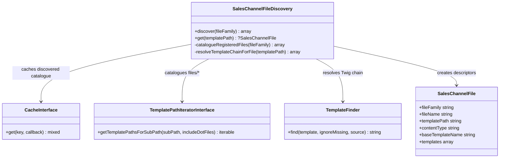

# Sales Channel Files

## Purpose

The `File` namespace provides generic public files scoped to a sales channel. Agentic files such as `llms.txt` and `agents.md` are the first file family, but the backend is intentionally not tied to agentic use cases.

Templates are registered below `Resources/views/files/<file-family>/**/*.twig`. The current default file family is `agentic`, so `Resources/views/files/agentic/llms.txt.twig` is served as `/llms.txt` when enabled for a sales channel.

## Terminology

- File family: the first path segment below `files`, for example `agentic` or a future `seo` family.
- File name: the normalized public path below the file family, without the `.twig` suffix, for example `llms.txt` or `.well-known/ucp.json`.
- Twig namespace: the owning template namespace, for example `Framework`, a plugin name, an app name, or a theme name.

## Key Decisions

- Discovery is template based. Core, plugins, apps, and themes contribute files by shipping Twig templates in the registered template system. There is no provider interface for individual files.
- The database stores sales-channel state only: one `sales_channel_file` row per sales channel, file family, and file name. The row controls enablement and stores merchant overrides in `template_overrides`, keyed by Twig namespace. The reserved `user_provided_content` key stores plain merchant notes that are rendered through a generated Twig override for the dedicated block of the same name.
- Shipped template content is never copied into the database. When code templates change, no migration is needed to update stored rows.
- Public serving is a fallback. Normal routes keep precedence because `SalesChannelFileNotFoundSubscriber` only handles unresolved 404s for main `GET` and `HEAD` requests that already have a sales channel context.
- Request paths are validated before they are mapped to a template path. Template discovery paths come from code and registered template storage.
- Discovery is cached per file family because it can run during 404 handling. Runtime responses are tagged with the matching `sales_channel_file.id`; template discovery changes are code changes and require a full cache clear.
- Merchant overrides are rendered through `SalesChannelFileTemplateOverrideLoader`, a high-priority Twig loader that is activated only for the duration of one render. The loader does not read the database, so public rendering and Administration previews use the same renderer without coupling Twig to request state.

## Namespace Layout

- `Discovery`: catalogues available files and resolves the contributing Twig template chain for each file.
- `Loader`: loads sales-channel configuration and coordinates public or preview rendering.
- `Rendering`: activates merchant override templates and renders the resolved Twig stack.
- `Api`: exposes Administration HTTP endpoints and assembles Administration read payloads.
- Root namespace: request path validation, 404 fallback serving, cache invalidation, and exceptions.

## Discovery Flow

Discovery has two responsibilities:

1. Catalogue which public files exist for a file family.
2. Resolve the Twig template chain for each file using the same `TemplateFinder` behavior used during rendering.

## Rendering Flow

```mermaid
classDiagram
    class SalesChannelFileNotFoundSubscriber {
        +onNotFound(event) void
    }

    class SalesChannelFileController {
        +list(fileFamily, salesChannelId, context) JsonResponse
        +detail(fileFamily, salesChannelId, request, context) JsonResponse
        +preview(fileFamily, salesChannelId, dataBag) JsonResponse
    }

    class SalesChannelFileAdministrationReader {
        +list(fileFamily, salesChannelId, context) array
        +detail(fileFamily, fileName, salesChannelId, context) ?array
    }

    class SalesChannelFileRequestPathResolver {
        +buildTemplatePath(fileFamily, fileName) string
        +validateFileFamily(fileFamily) void
    }

    class SalesChannelFileLoader {
        +load(templatePath, context) ?SalesChannelFileRenderResult
        +preview(templatePath, context, templateOverrides) ?SalesChannelFileRenderResult
    }

    class SalesChannelFileDiscovery {
        +discover(fileFamily) array
        +get(templatePath) ?SalesChannelFile
    }

    class SalesChannelFileConfigurationLoader {
        +load(fileFamily, fileName, salesChannelId, context) ?SalesChannelFileEntity
        +loadForFileFamily(fileFamily, salesChannelId, context) array
    }

    class SalesChannelFileRenderer {
        +render(file, context, templateOverrides) string
    }

    class SalesChannelFileTemplateOverrideLoader {
        +withTemplateOverrides(templateOverrides, callback) mixed
    }

    class TemplateFinder {
        +find(template) string
    }

    class Environment {
        +render(template, parameters) string
    }

    class CacheTagCollector {
        +addTag(tag) void
    }

    SalesChannelFileNotFoundSubscriber --> SalesChannelFileRequestPathResolver : validates request path
    SalesChannelFileNotFoundSubscriber --> SalesChannelFileLoader : public load
    SalesChannelFileController --> SalesChannelFileRequestPathResolver : validates API input
    SalesChannelFileController --> SalesChannelFileAdministrationReader : list/detail payloads
    SalesChannelFileController --> SalesChannelFileLoader : preview
    SalesChannelFileAdministrationReader --> SalesChannelFileDiscovery : lists discovered files
    SalesChannelFileAdministrationReader --> SalesChannelFileConfigurationLoader : loads stored rows
    SalesChannelFileAdministrationReader --> Environment : reads template source
    SalesChannelFileLoader --> SalesChannelFileDiscovery : resolves descriptor
    SalesChannelFileLoader --> SalesChannelFileConfigurationLoader : loads enabled row
    SalesChannelFileLoader --> CacheTagCollector : tags public response
    SalesChannelFileLoader --> SalesChannelFileRenderer : renders file
    SalesChannelFileRenderer --> SalesChannelFileTemplateOverrideLoader : activates overrides
    SalesChannelFileRenderer --> TemplateFinder : resolves base template
    SalesChannelFileRenderer --> Environment : renders Twig
```

For public requests the loader requires an enabled `sales_channel_file` row. For previews the loader renders a discovered file with the provided override payload, so unsaved Administration changes can be shown without writing to the database first.
